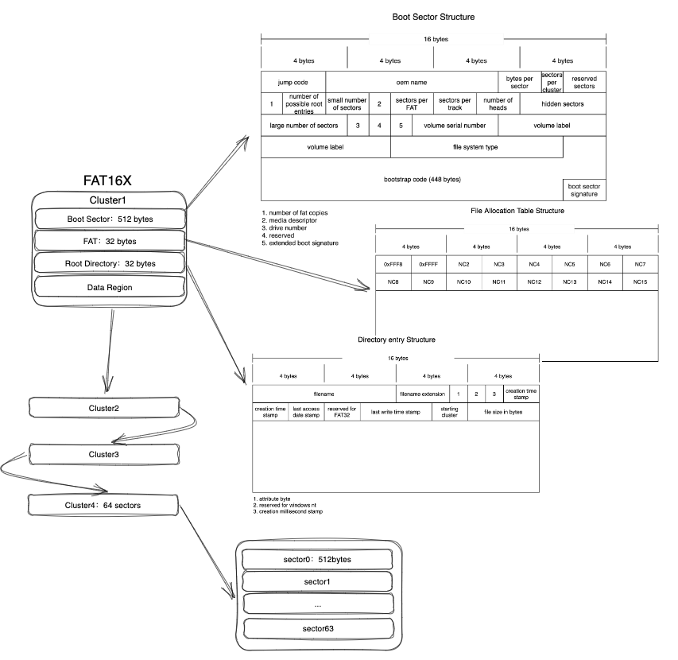
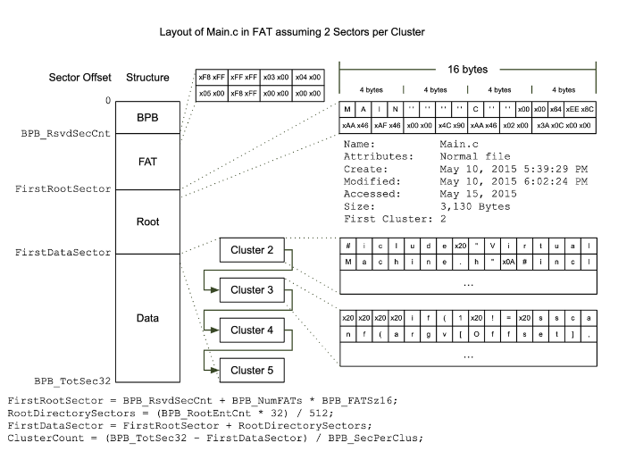
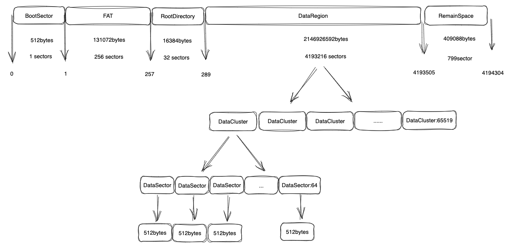

coding
=============================
打包命令：
mvn package -DskipTests

启动命令：
java -jar coding.jar --file.path=666
#1、系统模块划分
##1.1 命令行交互模块
基于picocli，整合springboot，快速构建一个java命令行程序。

[参考：a mighty tiny command line interface](https://picocli.info/)

[参考：Picocli-快速构建Java命令行程序](https://juejin.cn/post/6944734171050819614)

##1.2 FAT16X存储与命令行交互模块
##1.3 FAT16X底层存储模块

###1.3.1 数据结构

###1.3.1.1 Boot Sector
占用空间：512 bytes，1个扇区

    1、jump code干啥用的？
###1.3.1.2 FAT
占用空间：65536 * 2bytes = 131072bytes，256个扇区

    1、通过数组+链表维护所有的cluster信息
    2、文件可以存在于多个cluster中，每个cluster所在的坐标的数值，代表该cluster后续的状态：空，nextCluster，endFile
###1.3.1.3 Root Directory
占用空间：512 * 32 bytes = 16384bytes, 32个扇区

    1、ascii码与16进制相互转换
    2、文件属性枚举，对文件执行相关指令时，添加属性限制：比如只读文件，不可以执行echo写入指令
    3、文件名与文件拓展名长度限制
    4、更新操作时间
    5、更新写操作时间
    6、需要维护目录和文件的路径关系，支持ls,cd,pwd命令
    7、根据boot sector的配置，初始化directory entry array的size
###1.3.1.4 Data Region
占用空间：65536 * 64 * 512 = 2147483648bytes， 4194304个扇区

    1、建模：cluster
    2、cluster存储方式对比：
        a.每个cluster只允许存储一个文件or一个文件剩余的一部分。
            优点：写入和删除操作相对简单，尤其是删除时，直接清空对应cluster即可
            缺点：如果可能某个cluster只使用了1%的空间，会浪费空间
        b.每个cluster可以存储多个文件or多个文件的部分内容。
            优点：可以充分的利用每一寸空间，发现当前cluster存在剩余空间时，继续存储文件
            缺点：对于大文件，超过一个cluster空间时，除了记录nc（next cluster）以后，还要记录ncp（next cluster position）；逻辑复杂，写入和删除操作，尤其是删除操作，不能cluster维度进行清空，需要遍历清除
###1.3.2 流程逻辑
1、创建文件（添加写锁，上层应用层也可以添加写锁）mkdir,touch：
```
1、输入文件，判断root directory剩余空间是否支持写入，判断当前剩余cluster空间是否满足文件大小；输入目录，判断root directory剩余空间是否支持写入
2、step1通过后
    2.1 输入是目录，信息写入root directory，返回成功；
    2.2 输入是文件，文件基础信息写入root directory；把文件数据写入到data region（此步骤需要选择cluster，step1判断cluster空间时，就已经知道写入那个，不需要重新选择；
        需要注意文件过大，需要多个cluster，step1判断空间时，应该把所有用到的cluster信息全部透传给step2）
```
2、删除文件 rm：
```
1、输入文件or目录，判断root directory是否存在该文件
2、step1通过后
    2.1 根据root directory的数据，查询该文件对应的cluster信息
    2.2 清空对应cluster数据
```
3、格式化磁盘 format：
```
1、清空root directory数据
2、清空cluster数据
```
4、显示当前目录下的所有文件和子目录 ls
```
1、输入当前所在目录路径：
2、根据当前路径，去root directory查询其下边所有的目录和文件
问题：一级目录查询root directory就行，但是如果查询二级目录或者三级目录，就需要把该一级目录下所有cluster数据全部load出来，才能查询，性能有点差
```
5、切换目录 cd
```
1、判断用户输入的新目录，是否合法。支持多层级目录
2、切换当前用户所在目录
```
6、回显内容 echo
```
0、校验当前文件的属性，是否为只读
1、根据原有文件路径，计算已经占用的cluster数量，并结合当前空间空闲的cluster数量，计算最大可用的cluster数量
2、根据输入的内容，校验空间容量是否满足
    2.1 空间不满足，则返回失败
    2.2 空间满足，清除原有的cluster空间。并把新的内容写入到cluster中，记得更新root directory的文件基础信息（大小，更新时间）
```
7、显示文件内容 cat
```
1、根据文件路径，查询root directory存储的cluster信息
2、根据cluster信息，读取对应的数据，并返回
```
