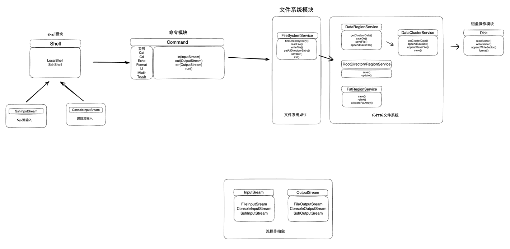

#1、远程连接手册：

    1、ssh -p 2222 xyl@localhost    (密码默认与当前登录用户名一致)

#2、任务2需求分析：

多用户连接

    1、文件系统并发控制：读写锁，open时传入锁模式，close时关闭锁
    2、多用户访问时，当前路径问题：每个用户都有自己独立的路径信息，默认为根目录；
    用户路径与当前登录用户对应的shell实例绑定，shell负责维护用户路径的生命周期，action可以读取或者修改用户路径

ssh远程：

    1、基于Apache mina sshd，自定义的MockShellWrapper，实现Command, ServerSessionAware接口
    2、注入MockShellWrapper，将sshd的in，out，err注入到mock shell的in，out，err
    3、获取用户连接信息，根据用户名分配对应的用户路径

文件系统新增api：

    1、rm：写入的逆向操作，关注目录不为空的条件
    2、clear：直接响应ESC[2J和ESC[1;1H

#3、最新模块划分：

